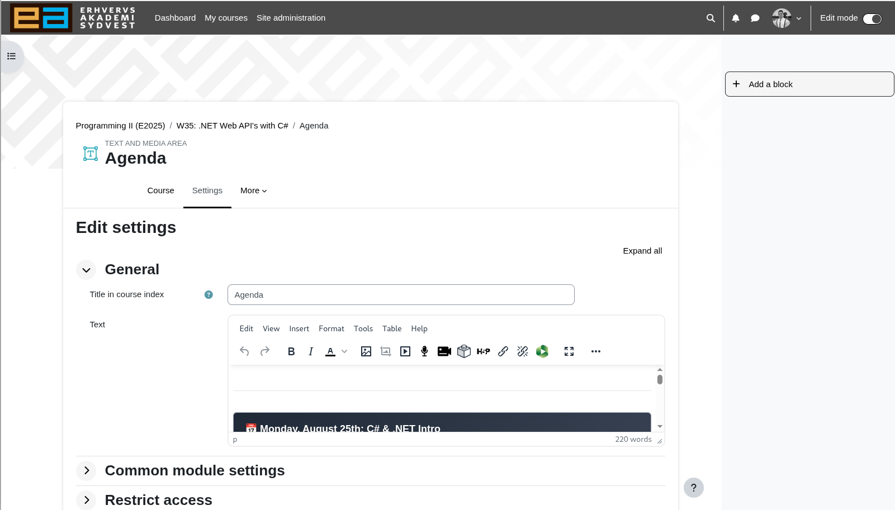
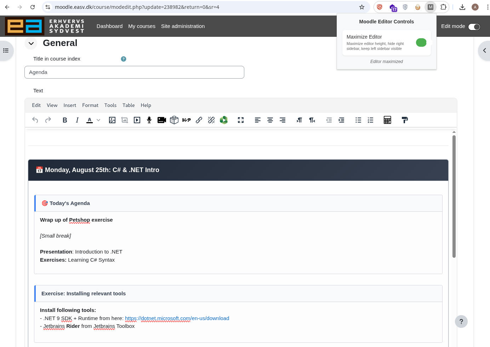

# Moodle TinyMCE Auto-Resizer

Browser extension that expands TinyMCE editors on Moodle sites. Activates only on editing pages.

<b>Before:</b>
 

<b>After:</b>
 

## Installation

1. Download from [releases](https://github.com/uldahlalex/fixmoodle/releases)
   - Chrome/Edge: `moodle-tinymce-auto-resizer-X.X.X-chrome.zip`
   - Firefox: `moodle-tinymce-auto-resizer-X.X.X-firefox.zip`
2. Extract zip file
3. Install in browser:

### Chrome/Edge
1. Open `chrome://extensions/`
2. Enable developer mode
3. Click "Load unpacked"
4. Select extracted folder

### Firefox
1. Open `about:debugging`
2. Click "This Firefox"
3. Click "Load Temporary Add-on"
4. Select `manifest.json` from extracted folder

## Features

- Only runs on Moodle editing pages
- Automatically resizes TinyMCE editors
- Detects and resizes dynamically loaded editors (also description, not just content)
- On/off toggle window
- Cross-browser support
- Respects opened sidebar

## Usage

1. Navigate to a Moodle editing page
2. Click extension icon in browser toolbar
3. Toggle "Maximize Editor" if not already toggled

### Supported Pages
- Module editing (`/modedit.php`)
- Course editing (`/course/edit.php`)
- Admin editing pages (`/admin/*edit*.php`)
- Question editing (`/question/*edit*`)
- Pages with `?action=edit` or `?mode=edit`

## Development

Built with [WXT](https://wxt.dev/) and TypeScript.

### Requirements
- Node.js 18+
- npm

### Issues

Report at [GitHub Issues](https://github.com/uldahlalex/fixmoodle/issues) with browser version, Moodle version, and reproduction steps.

## License

MIT License - see [LICENSE](LICENSE).

